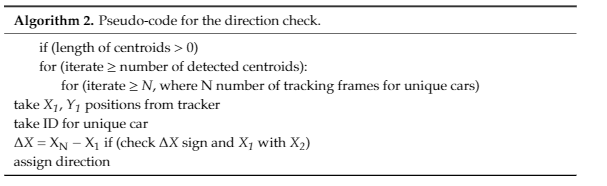
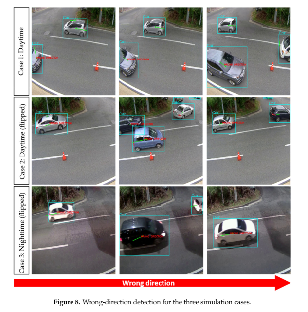

# Wrong Direction Drivers Detection
This project is to detect cars that move in the wrong way. Tensorflow implementation based on YOLOv3 detector and Kalman Filtering for the paper: [Real-Time, Deep Learning Based Wrong Direction Detection](https://www.mdpi.com/2076-3417/10/7/2453)
# Abstract
In this paper, we developed a real-time intelligent transportation system (ITS) to detect vehicles traveling the wrong way on the road. The concept of this wrong-way system is to detect such vehicles as soon as they enter an area covered by a single closed-circuit television (CCTV) camera. After detection, the program alerts the monitoring center and triggers a warning signal to the drivers. The developed system is based on video imaging and covers three aspects: detection, tracking, and validation. To locate a car in a video frame, we use a deep learning method known as you only look once version 3 (YOLOv3). Therefore, we used a custom dataset for training to create a deep-learning model. After estimating a car’s position, we implement linear quadratic estimation (also known as Kalman filtering) to track the detected vehicle during a certain period. Lastly, we apply an “entry-exit” algorithm to identify the car’s trajectory, achieving 91.98% accuracy in wrong-way driver detection.

# Features
1. Real-time detection (up to 35 FPS on Nvidia GTX1080Ti)
2. Support parallel training
3. Video and data are included with annotated files.

**[YouTube link](https://youtu.be/6l2DraCKW7g)**

# Getting started
## Requirements installation
This project is done on a Windows 10 machine with an already installed Anaconda platform. If you don't have one, you can install it from [here](https://www.anaconda.com/products/individual)
Creating an environment can be done by running.
```shell script
conda env create -f requirenments.yml
```
### Data
To run this program you need to download some files from [here](https://drive.google.com/drive/folders/1wjkvx32H-9VVPvz3ui8SuyNsp2g46NoO?usp=sharing) 
- [x] Download YOLOv3 model data and put it in the **model_data** folder
- [x] Download pre-trained data and put it in the **model** folder
- [x] Download the test video to run the program

### How to run
```shell script
conda activate car
```
This will activate the environment created from _requirenment.yml_ file

```shell script
python object_tracking.py --input <PATH to your video file you downloaded>
```

### How to train
First, create a YOLO format list of annotations. The example of the annotation file can be seen below
Generate your annotation file and class names file.  
    One row for one image;  
    Row format: `image_file_path box1 box2 ... boxN`;  
    Box format: `x_min,y_min,x_max,y_max,class_id` (no space).
    Here is an example:
    ```
    path/to/img1.jpg 50,100,150,200,0 30,50,200,120,3
    path/to/img2.jpg 120,300,250,600,2
    ...
    ```
Modify the _train.py_ file to adjust to your preference for training
 ``` python train.py  ```
 will start training
 
 This model is reasonably fast in training the model since it uses YOLOv3 416x416 image size.
### Object tracking
Object tracking is based on the Kalman filter algorithm and compared to the other ML algorithms it's fast and reasonably accurate, you can modify it to your own tracker.
### Direction estimation
The algorithm of estimation is simple



for the wrong direction estimation, you can modify _detector_car_person.py_ starting from line 279 as your task and wrong direction may be different from ours

### Results 
Here are the results of our work, this system is in current use, and it's practically effective.


## Contact 
If you think this work is useful, please give me a star! <br>
If you find any errors or have any suggestions, please contact me (**Email:** `u.s.saidrasul@inha.edu`). <br>

## Citation

```bash
@article{Real-Time,
  author = {Saidrasul Usmankhujaev, Shokhrukh Baydadaev, Kwon Jang Woo},
  title = {Real-Time, Deep Learning Based Wrong Direction Detection},
  year = {2020},
  journal = {DOI: 10.1109/ICSET51301.2020.9265355},
}
