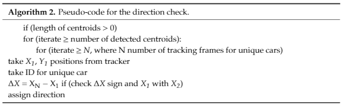
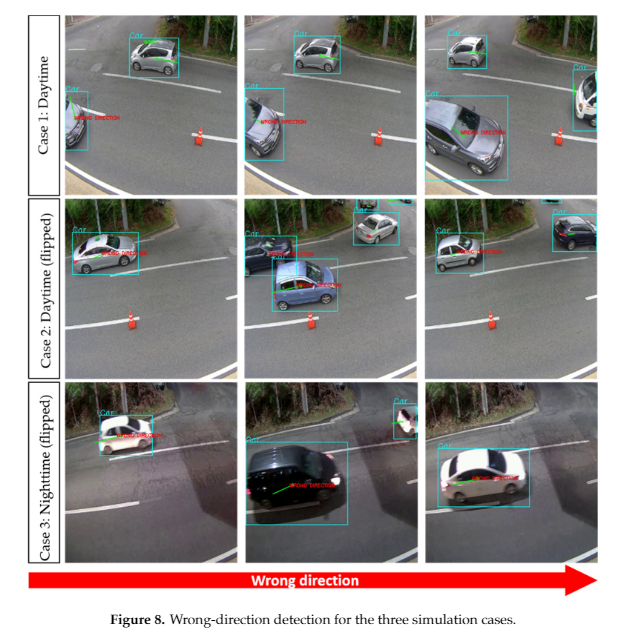

# Wrong Direction Drivers Detection

This project detects cars that move in the wrong direction on the road. It is the implementation for the paper: [Real-Time, Deep Learning Based Wrong Direction Detection](https://www.mdpi.com/2076-3417/10/7/2453)

> **⚠️ 2026 update — the original 2020 code now lives in [`legacy/`](./legacy).**
> The implementation published with the paper (TensorFlow 1.14 / Keras 2.2.4 YOLOv3 with a hand-written Kalman filter + Hungarian assignment tracker) is preserved unmodified in the [`legacy/`](./legacy) folder for reference and reproducibility. It targets Python 3.7 / CUDA 10 and is not runnable on modern systems.
> Everything at the repository root is the modernized implementation: **Ultralytics YOLO11** (PyTorch) detection, built-in **ByteTrack/BoT-SORT** tracking, and the paper's entry-exit direction-validation algorithm as a clean, configurable, unit-tested package.

## Repository structure

| Path | Purpose |
|---|---|
| `wrongway/` | The detection package: pipeline, direction/zone validators, calibration, events, notifiers, video I/O |
| `wrong_direction.py` | Entry point — `python wrong_direction.py --input video.mp4` |
| `configs/example_camera.yaml` | Fully documented per-camera configuration template |
| `train.py` | Fine-tune YOLO11 on a custom dataset |
| `convert_annotations.py` | Convert the 2020 annotation format to YOLO format |
| `evaluate.py` | Score a run against ground truth (paper Table 4 metrics) |
| `tests/` | Unit tests for the validation logic (run in CI) |
| `legacy/` | **The original 2020 code, exactly as published with the paper** |

# Abstract
In this paper, we developed a real-time intelligent transportation system (ITS) to detect vehicles traveling the wrong way on the road. The concept of this wrong-way system is to detect such vehicles as soon as they enter an area covered by a single closed-circuit television (CCTV) camera. After detection, the program alerts the monitoring center and triggers a warning signal to the drivers. The developed system is based on video imaging and covers three aspects: detection, tracking, and validation. To locate a car in a video frame, we use a deep learning method known as you only look once (YOLO). After estimating a car's position, we track the detected vehicle during a certain period. Lastly, we apply an "entry-exit" algorithm to identify the car's trajectory, achieving 91.98% accuracy in wrong-way driver detection.

# Pipeline
1. **Detection** — YOLO11 (pretrained on COCO: car, motorcycle, bus, truck, person). No custom anchors or training needed to get started; fine-tuning is one command.
2. **Tracking** — ByteTrack or BoT-SORT multi-object tracking (Kalman filter + association), built into Ultralytics.
3. **Validation** — two complementary implementations of the paper's algorithm, combinable via the `confirmation` setting:
   - **Displacement**: each track's entry-to-current displacement is projected onto the allowed direction; opposite motion beyond a threshold is a violation. Works in pixels, or in **road meters** when a ground-plane homography calibration is configured — making the threshold camera-independent. A **learned-flow** mode removes the fixed direction entirely: it learns the dominant per-region traffic flow during a calibration phase, then flags counter-flow tracks.
   - **Zones**: the paper's entry-exit areas — configurable polygons with `wrong_entries` (appearing in an exit area) and `wrong_transitions` (e.g., entering from B and reaching C) rules.
   - A **hysteresis** stage confirms a violation only after N consecutive wrong verdicts, suppressing single-frame false positives (e.g., nighttime illumination).
4. **Alerting** — confirmed violations produce an annotated snapshot, a pre/post video clip, a structured event log (JSONL and optionally SQLite), and notifications via webhook, Telegram, or MQTT.



**[YouTube link](https://youtu.be/6l2DraCKW7g)**

# Getting started

Requires Python 3.9+. Works on CPU, NVIDIA CUDA, and Apple Silicon (MPS) — the device is selected automatically.

```shell
python -m venv .venv
source .venv/bin/activate        # Windows: .venv\Scripts\activate
pip install -r requirements.txt
```

## How to run

```shell
python wrong_direction.py --input path/to/your_video.mp4 --direction west
```

Pretrained `yolo11n.pt` weights download automatically on first run. `--input` also accepts `rtsp://` / `http://` stream URLs (with automatic reconnection) or `camera` for a webcam. Press `q` to quit, `p` to pause/resume.

For everything beyond the basics, use a **per-camera YAML config** — [`configs/example_camera.yaml`](./configs/example_camera.yaml) documents every option (ROI, zones, calibration, learned flow, hysteresis, notifiers, clips, low-light enhancement, frame skipping):

```shell
python wrong_direction.py --config configs/my_camera.yaml
```

Outputs land in `result/`: snapshots, `clips/*.mp4` (3 s before/after each violation), and `events.jsonl` with one record per violation and per completed track.

## Evaluation

Reproduce the paper's Table 4 metrics on your own footage. Annotate ground truth as a CSV (`id,start_s,end_s,wrong`), run a detection pass, then:

```shell
python evaluate.py --events result/events.jsonl --ground-truth gt.csv
```

This prints the confusion matrix plus accuracy/precision/recall/F1, so algorithm changes are measurable.

## Performance tips

- `detection.detect_every: 2` (config) runs the detector on every 2nd frame — roughly 2× throughput.
- Export the model for your deployment target: `yolo export model=yolo11n.pt format=engine` (TensorRT), `format=coreml` (Apple), `format=openvino` (Intel).
- `detection.tracker: botsort.yaml` adds ReID for better identity retention under occlusion, at some speed cost.

## Development

```shell
pip install -e ".[dev]"
pytest          # 33 unit tests over the validation logic (torch-free, run in CI)
ruff check .
```

## How to train (optional)

The pretrained COCO model already detects vehicles well; fine-tune only for camera-specific data.

1. If you have annotations in the old format (`image.jpg x1,y1,x2,y2,class ...`), convert them:
   ```shell
   python convert_annotations.py --annotations model_data/your_annotations.txt
   ```
   This produces a YOLO-format dataset with a ready `data.yaml`.
2. Train:
   ```shell
   python train.py --data dataset/data.yaml --epochs 100
   ```
3. Use the result: `python wrong_direction.py --input video.mp4 --model runs/detect/train/weights/best.pt`

Anchor k-means, staged layer freezing, and manual data generators from the 2020 pipeline are no longer needed — YOLO11 is anchor-free and Ultralytics handles augmentation, LR scheduling, and early stopping.

## Legacy (2020) implementation

The code as published with the paper lives in [`legacy/`](./legacy), byte-for-byte as it was in 2020:

- `legacy/detector_car_person.py`, `legacy/object_tracking.py` — YOLOv3 detection and the video loop (Keras 2.2.4 / TensorFlow 1.14)
- `legacy/KalmanFilter.py`, `legacy/tracker.py` — the hand-written Kalman filter and Hungarian-assignment tracker
- `legacy/train.py`, `legacy/kmeans.py`, `legacy/yolo3/` — the training pipeline and anchor k-means
- `legacy/requirenment.yml` — the original conda environment (Python 3.7, CUDA 10, Windows)

It is kept for reference and reproducibility of the paper, not for new use — modern TensorFlow removed the APIs it relies on. The original model data and test video are [here](https://drive.google.com/drive/folders/1wjkvx32H-9VVPvz3ui8SuyNsp2g46NoO?usp=sharing).

### Results
Here are the results of our work, this system is in current use, and it's practically effective.


## Contact
If you think this work is useful, please give me a star! <br>
If you find any errors or have any suggestions, please contact me (**Email:** `u.s.saidrasul@inha.edu`). <br>

## Citation

```bash
@article{Real-Time,
  author = {Saidrasul Usmankhujaev, Shokhrukh Baydadaev, Kwon Jang Woo},
  title = {Real-Time, Deep Learning Based Wrong Direction Detection},
  year = {2020},
  journal = {DOI: 10.1109/ICSET51301.2020.9265355},
}
```
